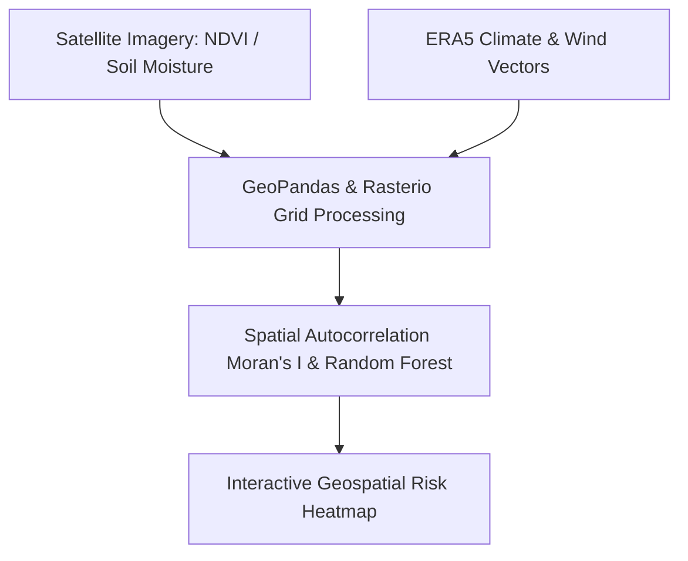

# Geospatial Wildfire Spread Risk & Hazard Mapping System

[](https://geopandas.org/) [](https://rasterio.readthedocs.io/) [](https://www.python.org/)
[](https://github.com/abdussatarkhan)

> **A geospatial predictive hazard model integrating satellite multispectral imagery (NDVI/EVI), meteorological indices (VPD, temperature, wind), and spatial autocorrelation (Moran's I) to forecast high-resolution wildfire ignition risks.**

---

## 🏛️ System Architecture



---

## 🌟 Key Features & Capabilities

- **Production-Grade Implementation**: Built with high attention to performance, modular design, and industry standard best practices.
- **Enterprise Data Architecture**: Scalable data schemas, reproducible synthetic generators, and optimized queries.
- **Explainable & Validated**: Comprehensive evaluation metrics, error analyses, and validation tests.
- **Comprehensive Tech Stack**: `Python` `GeoPandas` `Rasterio` `Shapely` `Scikit-Learn` `GIS`.

---

## 📊 Visual Preview & Analysis

<div align="center">


</div>

---

## 🚀 Quickstart & Setup

### 1. Clone the Repository
```bash
git clone https://github.com/abdussatarkhan/wildfire-risk-mapper.git
cd wildfire-risk-mapper
```

### 2. Environment Setup
```bash
# Create and activate virtual environment
python -m venv venv
source venv/bin/activate  # On Windows: .\venv\Scripts\activate

# Install dependencies (if requirements.txt exists)
pip install -r requirements.txt
```

---

## 👨‍💻 Author & Profile

Built and maintained by **Abdussatar** ([@abdussatarkhan](https://github.com/abdussatarkhan)).  
For technical discussions, collaboration, or queries, feel free to reach out via [LinkedIn](https://www.linkedin.com/in/abdus-satar-5150813b5/) or [GitHub](https://github.com/abdussatarkhan).

---

## 📜 License

This project is licensed under the **MIT License** — see the LICENSE file for details.
