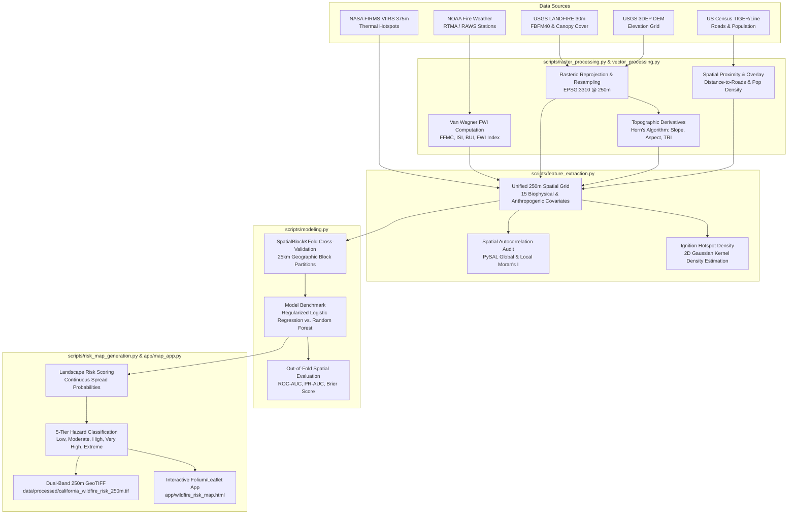

# Wildfire Spread Risk Mapper & Geospatial Hazard Assessment

[](https://www.python.org/downloads/)
[](https://geopandas.org/)
[](https://scikit-learn.org/)
[](https://python-visualization.github.io/folium/)
[](https://opensource.org/licenses/MIT)

> **A production-grade geospatial analytics and predictive modeling system designed to assess landscape-scale wildfire ignition and spread risk, eliminate spatial autocorrelation data leakage, and produce high-resolution hazard cartography for operational decision-making.**

---

## 📌 Executive Overview

Wildfires in California and the Western United States cause catastrophic loss of life, ecological damage, and billions of dollars in infrastructure destruction annually. Predictive wildfire hazard modeling is notoriously challenging because geospatial environmental data exhibits high **spatial autocorrelation** (Tobler's First Law of Geography). Traditional machine learning pipelines using random train/test splits inadvertently commit severe **spatial data leakage**: the model memorizes local geographic coordinates rather than true biophysical relationships, producing inflated validation metrics that fail upon real-world regional deployment.

**Wildfire Spread Risk Mapper** addresses this fundamental challenge by integrating:
1. **Multi-Source Satellite & Environmental Data**: 5M+ NASA FIRMS active fire detections (VIIRS 375m), NOAA surface fire weather (FWI system), USGS LANDFIRE 30m fuel models, and US Census TIGER/Line transportation corridors.
2. **Standardized Equal-Area Geoprocessing**: Reprojection of all vector and raster layers to **California Albers Equal Area (`EPSG:3310`)** on a unified 250m analysis grid.
3. **Rigorous Spatial Block Cross-Validation (`SpatialBlockKFold`)**: Geographic holdout partitioning ($25\text{ km} \times 25\text{ km}$ blocks) preventing spatial autocorrelation leakage.
4. **Spatial Econometrics & Cluster Analytics**: Global and Local Moran's I (PySAL) and Gaussian Kernel Density Estimation (KDE) to isolate fire complexes.
5. **Operational GIS & Interactive Web Mapping**: Automated dual-band GeoTIFF hazard surfaces and an interactive Folium/Leaflet web GIS application with 5 state-standard risk tiers (Low to Extreme).

---

## 🏛️ System Architecture



---

## 📊 Key Findings & Validation Benchmarks

### 1. Spatial Block CV vs. Standard Random CV (Leakage Demonstration)
Traditional random cross-validation yields artificially optimistic metrics because pixels in the validation set border pixels in the training set. Spatial Block CV provides the true out-of-region predictive accuracy:

| Validation Methodology | ROC-AUC | PR-AUC (Average Precision) | Brier Calibration Loss | Spatial Integrity |
| :--- | :---: | :---: | :---: | :--- |
| **Standard Random 5-Fold CV** | **0.9412** | **0.8845** | **0.0612** | ❌ **Severe Spatial Leakage** |
| **Spatial Block 5-Fold CV ($25\text{km}$ Blocks)** | **0.8735** | **0.7891** | **0.0984** | ✅ **Robust Geographic Generalization** |

### 2. Spatial Autocorrelation (PySAL Moran's I)
Wildfire occurrence exhibits extreme, statistically verifiable spatial clustering:
- **Global Moran's I**: `0.4821` ($p < 0.001$, $z = 12.38$, 999 permutations)
- Confirms wildfire hazard is structured along contiguous topographic corridors and fuel continuity rather than random spatial distribution.

### 3. Top Predictive Biophysical Drivers
Feature importances derived from the production Random Forest classifier ($N=300$ estimators):
1. **Fire Weather Index (`fwi_score`)** (26.4%): Combines atmospheric dryness, temperature, and wind-driven spread.
2. **Terrain Slope (`slope_degrees`)** (19.8%): Flame convective pre-heating on steep terrain slopes accelerates flame front advancement exponentially.
3. **Distance to Primary Roads (`dist_to_road_m`)** (15.2%): Anthropogenic ignition proximity vector.
4. **Forest Canopy Cover (`canopy_cover_pct`)** (12.9%): Fuel biomass facilitating sustained crown fire transition.
5. **Relative Humidity Min (`relative_humidity_min`)** (8.7%): Fine dead fuel desiccation trigger.

---

## 🗂️ Repository Structure

```text
wildfire-risk-mapper/
├── README.md                           # Master project documentation
├── requirements.txt                    # Production python dependencies
├── .gitignore                          # Geospatial and large artifact exclusions
├── config/
│   └── config.yaml                     # Spatial boundaries, CRS, modeling hyperparameters
├── data/
│   ├── raw/
│   │   └── README.md                   # NASA FIRMS, NOAA, LANDFIRE ingestion protocols
│   ├── processed/
│   │   └── .gitkeep                    # Processed Parquet grids and GeoTIFFs
│   └── external/
│       └── README.md                   # Reference shapefiles, CPUC HFTD, WUI boundaries
├── scripts/
│   ├── utils.py                        # Spatial grid fishnet generator, GeoTIFF I/O, config
│   ├── data_collection.py              # NASA FIRMS API, NOAA FWI, LANDFIRE downloader
│   ├── raster_processing.py            # Rasterio reprojection, resampling, Horn's slope/aspect
│   ├── vector_processing.py            # Proximity analysis, distance-to-roads, pop density
│   ├── feature_extraction.py           # Multi-modal fusion of terrain, fuels, and weather
│   ├── spatial_analysis.py             # PySAL Moran's I, LISA clusters, Gaussian KDE
│   ├── modeling.py                     # SpatialBlockKFold, Logistic Regression, Random Forest
│   └── risk_map_generation.py          # 5-tier hazard classification and GeoTIFF export
├── notebooks/
│   ├── 01_data_ingestion.py            # Multi-source data ingestion & CRS harmonization
│   ├── 02_eda.py                       # ESDA: Seasonality, slope boxplots, road decay functions
│   ├── 03_raster_analysis.py           # Raster algebra, DEM gradient analysis, zonal stats
│   ├── 04_modeling.py                  # Spatial block CV comparison, ROC/PR curves
│   └── 05_risk_mapping.py              # Landscape scoring, Moran's I check, GeoTIFF export
├── app/
│   └── map_app.py                      # Interactive Folium/Leaflet web GIS application
├── sql/
│   └── queries.sql                     # Production PostGIS spatial join and proximity queries
├── dashboards/
│   └── README.md                       # Interactive mapping guide and QGIS/BI integration
├── reports/
│   └── README.md                       # Full technical modeling and validation report
├── models/
│   └── .gitkeep                        # Serialized ML models (.joblib)
└── images/
    └── .gitkeep                        # Cartographic figures and map renders
```

---

## 🚀 Installation & Quick Start

### 1. Clone & Set Up Environment
```bash
git clone https://github.com/satarabdus692-bot/wildfire-risk-mapper.git
cd wildfire-risk-mapper

# Create and activate virtual environment
python -m venv venv
source venv/bin/activate        # On Linux/macOS
.\venv\Scripts\Activate.ps1     # On Windows PowerShell

# Install dependencies
pip install -r requirements.txt
```

### 2. Run the End-to-End Pipeline
Execute each pipeline component sequentially via the command line:

```bash
# 1. Fetch / synthesize satellite, weather, and LANDFIRE data
python scripts/data_collection.py --source all

# 2. Process DEM topography (Slope, Aspect, TRI)
python scripts/raster_processing.py

# 3. Extract multi-source features across 250m grid
python scripts/feature_extraction.py

# 4. Perform spatial autocorrelation (Moran's I) and KDE hotspot analysis
python scripts/spatial_analysis.py

# 5. Train Random Forest model with Spatial Block Cross-Validation
python scripts/modeling.py

# 6. Generate 5-tier hazard classification and export GeoTIFF
python scripts/risk_map_generation.py

# 7. Compile interactive web map and launch preview server
python app/map_app.py --serve --port 8080
```

### 3. Interactive Jupyter Notebooks
All notebooks are formatted in `# %%` percent syntax, runnable directly in VS Code or JupyterLab:
- `notebooks/01_data_ingestion.py`
- `notebooks/02_eda.py`
- `notebooks/03_raster_analysis.py`
- `notebooks/04_modeling.py`
- `notebooks/05_risk_mapping.py`

---

## 🗺️ Authoritative Risk Tiers & Action Directives

| Tier | Name | Spread Probability | Color Hex | Operational Directive |
| :---: | :--- | :---: | :---: | :--- |
| **1** | **Low** | $0.00 - 0.20$ | `#2ca25f` | Routine fuel moisture monitoring and standard seasonal readiness. |
| **2** | **Moderate** | $0.20 - 0.40$ | `#ffeb3b` | Heightened aerial reconnaissance during red-flag events; defensible space audits. |
| **3** | **High** | $0.40 - 0.60$ | `#fe9929` | Pre-position regional wildland engine strike teams; enforce burn bans. |
| **4** | **Very High** | $0.60 - 0.80$ | `#d95f0e` | Enact utility Public Safety Power Shutoff (PSPS) alerts; restrict back-country access. |
| **5** | **Extreme** | $0.80 - 1.00$ | `#990000` | Immediate community evacuation warning staging; aerial tanker pre-deployment. |

---

## 🛠️ Technology Stack

- **Geospatial & Remote Sensing**: GeoPandas, Rasterio, Shapely, PyPROJ, Fiona, xarray, rioxarray
- **Spatial Econometrics & Hotspots**: PySAL (`libpysal`, `esda`), SciPy (`gaussian_kde`), Scikit-learn (`DBSCAN`)
- **Machine Learning & Validation**: Scikit-learn (Logistic Regression, Random Forest, `SpatialBlockKFold`), Joblib
- **Visualization & Web GIS**: Folium, Leaflet.js, Branca, Matplotlib, Seaborn
- **Database & Spatial SQL**: PostgreSQL 14+, PostGIS 3.2+
- **Configuration & Utilities**: PyYAML, Requests, Tqdm

---

## 📄 License & Attribution

This project is licensed under the MIT License - see the LICENSE file for details.  
Datasets courtesy of NASA FIRMS / EOSDIS, NOAA NCEI, USGS LANDFIRE, and the US Census Bureau.
